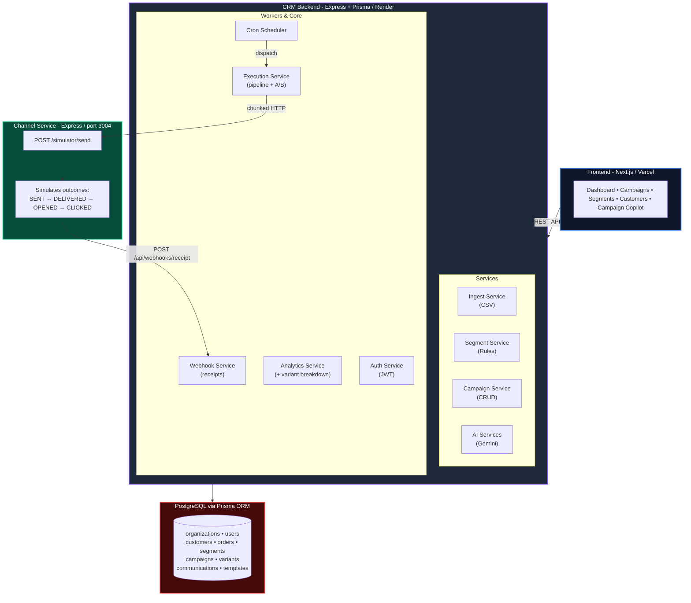
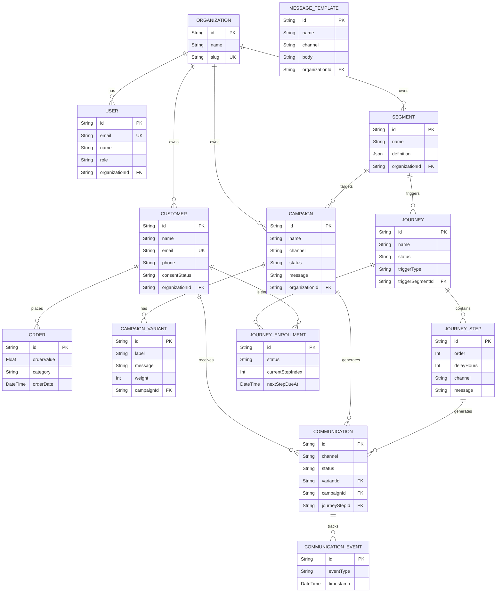

# Moda CRM — AI-Native Mini CRM for Reaching Shoppers

A full-stack, AI-native CRM platform that helps D2C brands **decide who to talk to, what to say, and reach them** across WhatsApp, SMS, Email, and RCS.

---

## Architecture Overview



## Database Schema



---

## How AI Is Woven Into the Product

AI is integrated at **three distinct decision points**, not bolted on:

| Integration Point | Service | Model | What It Does |
|---|---|---|---|
| **Segment Suggestion** | `AI.service.ts` | Gemini 2.0 Flash | Translates natural-language audience descriptions into structured database filters using JSON schema enforcement |
| **Campaign Copilot** | `AICampaign.service.ts` | Gemini 2.0 Flash | RAG pipeline: retrieves audience metrics from DB, augments system prompt, generates optimal channel + personalized message |
| **Post-Campaign Insights** | `insights.service.ts` | Gemini 1.5 Flash | Converts funnel metrics into executive summary, identifies bottlenecks, and recommends next actions |

---

## API Endpoints

### Auth
| Method | Path | Description |
|--------|------|-------------|
| `POST` | `/api/auth/register` | Register new user + organization |
| `POST` | `/api/auth/login` | Login, returns JWT token |
| `GET` | `/api/auth/me` | Get current user profile (requires auth) |

### Customers
| Method | Path | Description |
|--------|------|-------------|
| `GET` | `/api/customers` | Paginated customer list (query: `page`, `limit`) |
| `GET` | `/api/customers/dashboard` | Dashboard aggregate stats |
| `GET` | `/api/customers/top?limit=10` | Top customers by lifetime spend |
| `GET` | `/api/customers/search` | Search/filter customers (query: `q`, `city`, `gender`, `tag`) |
| `GET` | `/api/customers/:id` | Customer profile with order history |
| `GET` | `/api/customers/:id/metrics` | Aggregated metrics (AOV, total spend) |
| `GET` | `/api/customers/:id/activity` | Customer activity timeline |
| `POST` | `/api/ingestion/upload/customers` | Bulk import customers via CSV |
| `POST` | `/api/ingestion/upload/orders` | Bulk import orders via CSV |
| `POST` | `/api/import/csv` | AI-powered CSV import (arbitrary columns → Customer shape) |
| `POST` | `/api/import/chunk` | AI import of a single pre-parsed chunk |

### Segments
| Method | Path | Description |
|--------|------|-------------|
| `GET` | `/api/segments` | List all segments |
| `POST` | `/api/segments` | Create and evaluate a segment |
| `POST` | `/api/segments/evaluate` | Preview audience count without saving |

### AI
| Method | Path | Description |
|--------|------|-------------|
| `POST` | `/api/ai/segment-suggest` | Natural language → segment filters (Gemini) |

### Campaigns
| Method | Path | Description |
|--------|------|-------------|
| `GET` | `/api/campaigns` | List all campaigns |
| `GET` | `/api/campaigns/:id` | Campaign details with communication stats |
| `POST` | `/api/campaigns/draft` | AI-powered campaign drafting (channel + message) |
| `PATCH` | `/api/campaigns/:id/status` | Update campaign status (DRAFT → SCHEDULED → RUNNING) |
| `GET` | `/api/campaigns/:id/analytics` | Funnel metrics + AI insights + variant breakdown |

### A/B Campaign Variants
| Method | Path | Description |
|--------|------|-------------|
| `GET` | `/api/campaigns/:id/variants` | List A/B variants for a campaign |
| `POST` | `/api/campaigns/:id/variants` | Add a variant (label, message, weight) |
| `DELETE` | `/api/campaigns/:id/variants/:variantId` | Delete a variant |

### Message Templates
| Method | Path | Description |
|--------|------|-------------|
| `GET` | `/api/templates` | List templates (optional `?channel=` filter) |
| `GET` | `/api/templates/:id` | Get template with extracted tokens |
| `POST` | `/api/templates` | Create a new template |
| `PATCH` | `/api/templates/:id` | Update a template |
| `DELETE` | `/api/templates/:id` | Delete a template |

### Consent
| Method | Path | Description |
|--------|------|-------------|
| `PATCH` | `/api/consent/:customerId` | Update customer consent status |

### Journeys
| Method | Path | Description |
|--------|------|-------------|
| `GET` | `/api/journeys` | List journeys with step/enrollment counts |
| `POST` | `/api/journeys` | Create a journey (trigger + ordered steps) |
| `GET` | `/api/journeys/:id` | Journey detail incl. steps + enrollment stats |
| `PATCH` | `/api/journeys/:id/status` | Transition DRAFT → ACTIVE → PAUSED → ARCHIVED |
| `POST` | `/api/journeys/:id/steps` | Add a step (DRAFT journeys only) |
| `DELETE` | `/api/journeys/:id/steps/:stepId` | Remove a step (DRAFT journeys only) |
| `GET` | `/api/journeys/:id/enrollments` | List customer enrollments and their progress |

### Webhooks
| Method | Path | Description |
|--------|------|-------------|
| `POST` | `/api/webhooks/receipt` | Receive delivery/engagement events from channel service |

### Channel Service (separate process, port 3004)
| Method | Path | Description |
|--------|------|-------------|
| `POST` | `/simulator/send` | Accept a communication, simulate delivery outcome |
| `GET` | `/health` | Health check |

---

## Scale Assumptions & Tradeoffs

| Decision | Rationale |
|---|---|
| **Segment evaluation via Prisma `groupBy` + `having`** | Pushes aggregation to PostgreSQL. Works well up to ~100K customers. At scale, I'd use a pre-computed materialized view or a streaming pipeline (Kafka → ClickHouse). |
| **Chunked dispatch (50/batch) with `Promise.allSettled`** | Prevents overwhelming the channel service. Each chunk is independent — one failure doesn't abort others. At scale, I'd use a proper message queue (Bull/BullMQ or SQS). |
| **Serializable transaction for webhook processing** | Prevents race conditions when multiple events for the same communication arrive simultaneously. The `STATUS_RANK` guard ensures out-of-order events never downgrade status. At scale, I'd use Redis-based idempotency keys. |
| **Cron-based campaign scheduler (1-minute polling)** | Simple and reliable for this scope. At scale, I'd use a delay queue or scheduler service (e.g., Temporal) for second-level precision. |
| **7-day conversion attribution via raw SQL** | A deliberate JOIN between communications and orders with a time window. At scale, this would be a batch job or a streaming attribution pipeline. |
| **Channel service as separate process (no shared DB)** | Mirrors real-world architecture where delivery providers are external services. Communication is purely HTTP-based: CRM sends, channel simulates and calls back. |
| **AI structured output with `responseMimeType` + `responseSchema`** | Guarantees valid JSON from Gemini. Eliminates regex-based parsing. Fallback: markdown fence stripping + try/catch. |
| **A/B variant assignment via weighted random** | Simple in-memory weighted selection at execution time. Each Communication records its `variantId` for per-variant analytics. |
| **React Query for frontend data fetching** | Eliminates redundant concurrent fetches that caused PostgreSQL deadlocks. Built-in caching (30s stale time) prevents re-fetches on rapid navigation. |

---

## Tech Stack

| Layer | Technology |
|-------|------------|
| **Frontend** | Next.js 16, React 19, TypeScript, Tailwind CSS 4, Framer Motion, React Query |
| **Backend** | Node.js, Express 4, TypeScript 5 |
| **Auth** | JWT (jsonwebtoken), bcryptjs |
| **ORM** | Prisma 6 |
| **Database** | PostgreSQL |
| **AI** | Google Gemini (2.0 Flash, 1.5 Flash) via `@google/genai` SDK |
| **File uploads** | Multer (memory storage) + csv-parser |
| **Scheduling** | node-cron |
| **Deployment** | Vercel (frontend), Render (backend) |

---

## How to Run Locally

### Prerequisites
- Node.js 18+
- PostgreSQL running locally
- A database named `xeno_crm`

### 1. Backend
```bash
cd Backend
npm install
cp env.example .env    # Fill in DATABASE_URL, GEMINI_API_KEY, JWT_SECRET
npx prisma generate
npx prisma db push
npm run db:seed        # Creates default org (Moda Demo), admin user, 2000 customers, orders, segments, campaigns
npm run dev            # Starts on port 3001
```

**Default Login Credentials:**
- Email: `admin@moda.com`
- Password: `password123`

### 2. Channel Service
```bash
cd Channel
npm install
npm run dev            # Starts on port 3004
```

### 3. Frontend
```bash
cd frontend
npm install
npm run dev            # Starts on port 3000
```

Open `http://localhost:3000` to access the CRM dashboard.

---

## Project Structure

```
├── Backend/                    # CRM API server (port 3001)
│   ├── Prisma/
│   │   ├── schema.prisma       # 13-model relational schema (Organization, User, Customer, Journey, etc.)
│   │   └── seed.ts             # Persona-driven realistic data generator + default org/user
│   └── src/
│       ├── config/             # Prisma singleton
│       ├── controllers/        # HTTP layer (request parsing, response shaping)
│       ├── services/           # Business logic (AI, campaigns, segments, analytics, auth, execution)
│       ├── repositories/       # Data access layer
│       ├── routes/             # Express route definitions (auth, campaigns, segments, etc.)
│       ├── cron/               # Campaign scheduler (1-min polling)
│       ├── middleware/         # Auth (JWT), error handler
│       ├── types/              # CRM type definitions
│       └── utils/              # Response helpers
├── Channel/                    # Stubbed channel simulator (port 3004)
│   └── src/index.ts            # Standalone Express app
├── frontend/                   # Next.js dashboard
│   └── src/
│       ├── app/                # Pages (dashboard, campaigns, segments, customers)
│       │   └── components/     # Sidebar, QueryProvider, shared UI
│       └── lib/
│           ├── api.ts          # Typed API client with JWT auth token management
│           └── hooks.ts        # React Query hooks for all data fetching
└── README.md
```

---

## Multi-Tenancy & Auth

The CRM supports **organization-scoped data isolation**:

- **Organization** — top-level tenant. All customers, segments, campaigns, and templates are scoped to an organization.
- **User** — belongs to an organization. Roles: `ADMIN`, `MEMBER`.
- **JWT Authentication** — `POST /api/auth/login` returns a signed JWT. The `optionalAuth` middleware attaches `req.auth` to every request. When present, all queries are automatically filtered by `organizationId`.
- **Backward Compatibility** — unauthenticated requests still work (no org filter applied), making it safe to run without auth during development.

## A/B Testing

Campaigns support **weighted A/B variant testing**:

1. **Create variants** via `POST /api/campaigns/:id/variants` with a `label`, `message`, and optional `weight` (default: 1).
2. **Execution** assigns each customer to a variant using weighted random selection. The variant's message template replaces the campaign's base message.
3. **Analytics** includes a `variantBreakdown` array in `GET /api/campaigns/:id/analytics`, showing per-variant funnel metrics (delivered rate, open rate, click rate).

## Journeys — Trigger-Based Automation

Unlike Campaigns (one-off blasts a marketer launches manually), **Journeys** enroll customers automatically and walk them through an ordered, timed sequence of messages — welcome series, win-back flows, post-purchase follow-ups.

- **Triggers**: `CUSTOMER_CREATED` (on signup), `ORDER_PLACED` (on any order), `SEGMENT_ENTRY` (any customer currently matching a chosen segment — enrolled once, the first time they're seen matching).
- **Steps**: an ordered list of `{ delayHours, channel, message }`. Step 0 sends immediately (or on the next scan); each subsequent step waits `delayHours` after the previous one.
- **Engine**: a dedicated cron (`journey.cron.ts`, every 5 minutes by default — `JOURNEY_CRON_SCHEDULE`) runs two passes: an **enrollment scan** (evaluates triggers, enrolls newly-qualifying customers) and a **step dispatch** (sends any step whose delay has elapsed).
- **Shared pipeline**: journey sends reuse the exact same `Communication` tracking table, channel dispatch, webhook-driven status updates, and consent suppression as Campaigns (see `dispatch.util.ts`) — so a journey message is indistinguishable in analytics and the customer activity timeline from a campaign message, aside from its origin label.
- **Consent-aware**: opted-out customers are never enrolled; a customer who opts out mid-journey has their enrollment marked `EXITED` on the next dispatch pass instead of receiving further steps.

---

## Limitations & Known Issues

1. **Queueing System:** Webhook processing and campaign execution rely on simple promises and cron scheduling. A robust message queue (like BullMQ or RabbitMQ) would be required to handle massive scale reliably.
2. **Login UI:** The CRM has full JWT auth infrastructure but no login page in the frontend yet. Use the API directly or set the token via `setAuthToken()` in the browser console.
3. **Real-time Updates:** Analytics are polled on page load. WebSocket/SSE integration would enable live dashboard updates.
