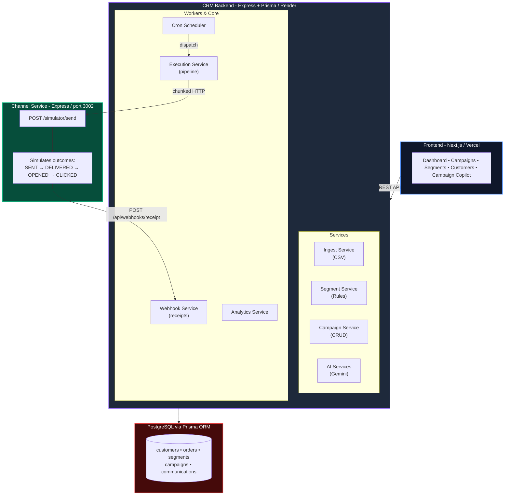
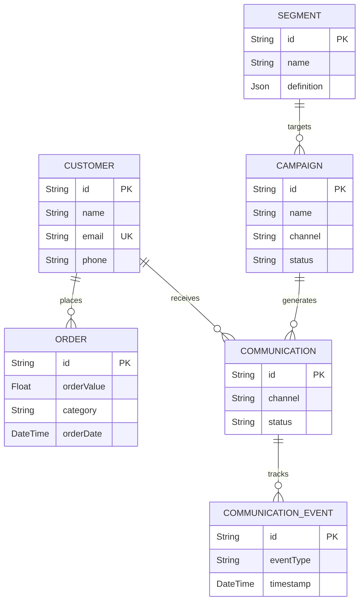

# Moda CRM — AI-Native Mini CRM for Reaching Shoppers

A full-stack, AI-native CRM platform that helps D2C brands **decide who to talk to, what to say, and reach them** across WhatsApp, SMS, Email, and RCS.

Built for the Xeno Engineering Internship Assignment 2026.

---

## Architecture Overview



## Database Schema



---

## How AI Is Woven Into the Product

AI is integrated at **three distinct decision points**, not bolted on:

| Integration Point | Service | Model | What It Does |
|---|---|---|---|
| **Segment Suggestion** | `AI.service.ts` | Gemini 2.0 Flash | Translates natural-language audience descriptions into structured database filters using JSON schema enforcement |
| **Campaign Copilot** | `AICampaign.service.ts` | Gemini 2.0 Flash | RAG pipeline: retrieves audience metrics from DB, augments system prompt, generates optimal channel + personalized message |
| **Post-Campaign Insights** | `insights.service.ts` | Gemini 1.5 Flash | Converts funnel metrics into executive summary, identifies bottlenecks, and recommends next actions |

---

## API Endpoints

### Customers
| Method | Path | Description |
|--------|------|-------------|
| `GET` | `/api/customers` | Paginated customer list (query: `page`, `limit`) |
| `GET` | `/api/customers/dashboard` | Dashboard aggregate stats |
| `GET` | `/api/customers/top?limit=10` | Top customers by lifetime spend |
| `GET` | `/api/customers/:id` | Customer profile with order history |
| `GET` | `/api/customers/:id/metrics` | Aggregated metrics (AOV, total spend) |
| `POST` | `/api/ingestion/customers/upload` | Bulk import customers via CSV |
| `POST` | `/api/ingestion/orders/upload` | Bulk import orders via CSV |

### Segments
| Method | Path | Description |
|--------|------|-------------|
| `GET` | `/api/segments` | List all segments |
| `POST` | `/api/segments` | Create and evaluate a segment |
| `POST` | `/api/segments/evaluate` | Preview audience count without saving |

### AI
| Method | Path | Description |
|--------|------|-------------|
| `POST` | `/api/ai/segment-suggest` | Natural language → segment filters (Gemini) |

### Campaigns
| Method | Path | Description |
|--------|------|-------------|
| `GET` | `/api/campaigns` | List all campaigns |
| `GET` | `/api/campaigns/:id` | Campaign details with communication stats |
| `POST` | `/api/campaigns/draft` | AI-powered campaign drafting (channel + message) |
| `PATCH` | `/api/campaigns/:id/status` | Update campaign status (DRAFT → SCHEDULED → RUNNING) |
| `GET` | `/api/campaigns/:id/analytics` | Funnel metrics + AI insights |

### Webhooks
| Method | Path | Description |
|--------|------|-------------|
| `POST` | `/api/webhooks/receipt` | Receive delivery/engagement events from channel service |

### Channel Service (separate process, port 3002)
| Method | Path | Description |
|--------|------|-------------|
| `POST` | `/simulator/send` | Accept a communication, simulate delivery outcome |
| `GET` | `/health` | Health check |

---

## Scale Assumptions & Tradeoffs

| Decision | Rationale |
|---|---|
| **Segment evaluation via Prisma `groupBy` + `having`** | Pushes aggregation to PostgreSQL. Works well up to ~100K customers. At scale, I'd use a pre-computed materialized view or a streaming pipeline (Kafka → ClickHouse). |
| **Chunked dispatch (50/batch) with `Promise.allSettled`** | Prevents overwhelming the channel service. Each chunk is independent — one failure doesn't abort others. At scale, I'd use a proper message queue (Bull/BullMQ or SQS). |
| **Serializable transaction for webhook processing** | Prevents race conditions when multiple events for the same communication arrive simultaneously. The `STATUS_RANK` guard ensures out-of-order events never downgrade status. At scale, I'd use Redis-based idempotency keys. |
| **Cron-based campaign scheduler (1-minute polling)** | Simple and reliable for this scope. At scale, I'd use a delay queue or scheduler service (e.g., Temporal) for second-level precision. |
| **7-day conversion attribution via raw SQL** | A deliberate JOIN between communications and orders with a time window. At scale, this would be a batch job or a streaming attribution pipeline. |
| **Channel service as separate process (no shared DB)** | Mirrors real-world architecture where delivery providers are external services. Communication is purely HTTP-based: CRM sends, channel simulates and calls back. |
| **AI structured output with `responseMimeType` + `responseSchema`** | Guarantees valid JSON from Gemini. Eliminates regex-based parsing. Fallback: markdown fence stripping + try/catch. |

---

## Tech Stack

| Layer | Technology |
|-------|------------|
| **Frontend** | Next.js 16, React 19, TypeScript, Tailwind CSS 4, Framer Motion |
| **Backend** | Node.js, Express 4, TypeScript 5 |
| **ORM** | Prisma 6 |
| **Database** | PostgreSQL |
| **AI** | Google Gemini (2.0 Flash, 1.5 Flash) via `@google/genai` SDK |
| **File uploads** | Multer (memory storage) + csv-parser |
| **Scheduling** | node-cron |
| **Deployment** | Vercel (frontend), Render (backend) |

---

## How to Run Locally

### Prerequisites
- Node.js 18+
- PostgreSQL running locally
- A database named `xeno_crm`

### 1. Backend
```bash
cd Backend
npm install
cp env.example .env    # Fill in DATABASE_URL and GEMINI_API_KEY
npx prisma generate
npx prisma db push
npm run db:seed        # Generate 2000 customers, orders, segments, campaigns
npm run dev            # Starts on port 3001
```

### 2. Channel Service
```bash
cd Channel
npm install
npm run dev            # Starts on port 3002
```

### 3. Frontend
```bash
cd frontend
npm install
npm run dev            # Starts on port 3000
```

Open `http://localhost:3000` to access the CRM dashboard.

---

## Project Structure

```
├── Backend/                    # CRM API server (port 3001)
│   ├── Prisma/
│   │   ├── schema.prisma       # 6-model relational schema
│   │   └── seed.ts             # Persona-driven realistic data generator
│   └── src/
│       ├── config/             # Prisma singleton
│       ├── controllers/        # HTTP layer (request parsing, response shaping)
│       ├── services/           # Business logic (AI, campaigns, segments, analytics)
│       ├── repositories/       # Data access layer
│       ├── routes/             # Express route definitions
│       ├── cron/               # Campaign scheduler (1-min polling)
│       ├── middleware/         # Error handler
│       └── utils/              # Response helpers
├── Channel/                    # Stubbed channel simulator (port 3002)
│   └── src/index.ts            # Standalone Express app
├── frontend/                   # Next.js dashboard
│   └── src/
│       ├── app/                # Pages (dashboard, campaigns, segments, customers)
│       │   └── components/     # Sidebar, shared UI
│       └── lib/api.ts          # Typed API client
└── README.md
```

---

## Limitations & Known Issues

Due to the time-constrained nature of this assignment, there are a few known limitations:

1. **Transaction Deadlocks on Rapid Refreshes:** 
   - *Issue:* If the dashboard or data-heavy pages are refreshed too quickly, it triggers multiple concurrent data fetch requests to the backend. Under heavy load, this can occasionally result in PostgreSQL transaction deadlocks.
   - *Planned Fix:* Implementing robust client-side caching (using tools like React Query, SWR, or Next.js App Router caching mechanisms) and request debouncing would prevent redundant API calls and resolve this issue.
2. **Authentication & Authorization:** The CRM currently lacks a login system. All routes are publicly accessible, which is typical for an MVP but would need a proper Auth provider (e.g., NextAuth, Clerk) for production.
3. **Queueing System:** Webhook processing and campaign execution rely on simple promises and cron scheduling. A robust message queue (like BullMQ or RabbitMQ) would be required to handle massive scale reliably.
